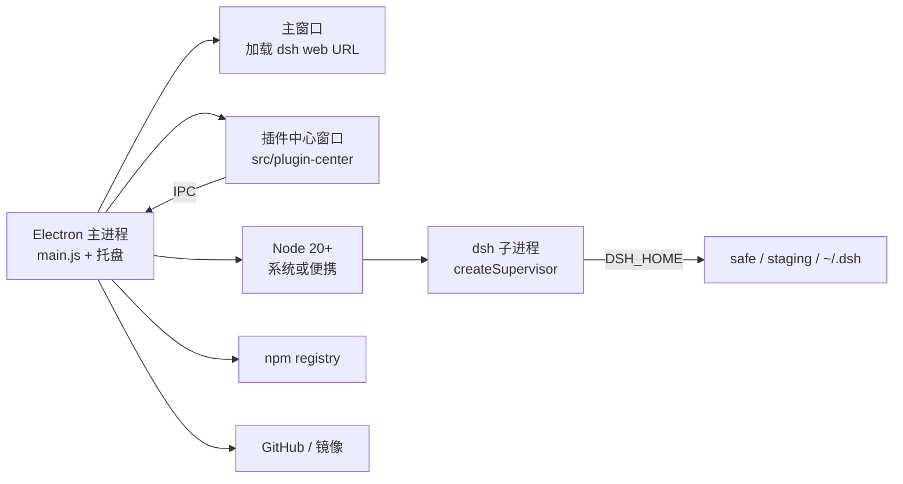
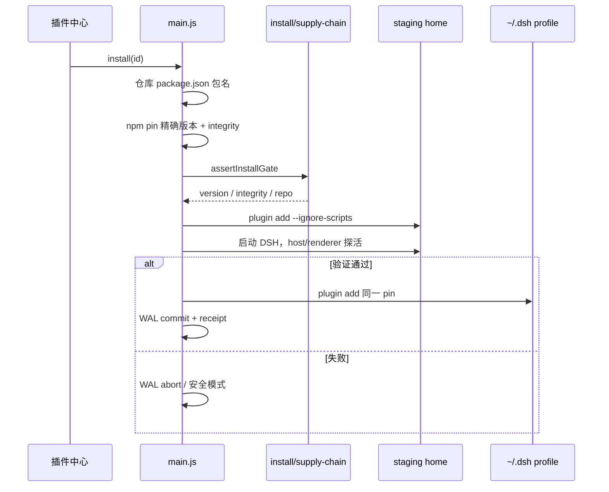

# 架构

本文描述 **当前有效代码** 的实际行为，而不是早期规划里尚未接线的路径。

## 1. 进程模型



原则：

- 壳进程与 DSH 子进程隔离。插件把 Host 打崩时，托盘和卸载入口仍在。
- 监督器状态：`stopped | starting | running | crashed | stopping`。崩溃后可选退避重启到 **safe**（默认开启）。
- Electron 的 `process.execPath` 不是 Node。跑 `dsh` 的 JS 入口时必须传入真正的 `node.exe`。
- 单实例锁：`local.dsh.tray`。第二次启动只唤起已有窗口。

官方 DSH 用单个 `$DSH_HOME`（默认 `~/.dsh`），社区插件在 `$DSH_HOME/profiles/<name>/`。隔离方式是 **同一份二进制 + 不同 home**，不是第二套 DSH。

## 2. 启动

`app.whenReady()` → `boot()`：

1. `ensureHomes(shellDshRoot)`，WAL `recover()`
2. `configureCatalog({ cacheDir })`，后台 `refreshCatalog({ waitForSignals: false })`
3. 创建主窗口与托盘；窗口先显示启动页。带 `--autostart`（开机自启）时窗口留在托盘，不弹出
4. `ensureRuntime()`：系统 Node，或解压便携 Node；若没有 dsh 入口则 `npm install -g`
5. `startServer({ fallbackToSafe: true })`：按 `state.safeBootRequired` 选 `safe` 或 `active`。active 起不来时会同步凭证到 safe 再试安全模式，对话框里的错误已经过 `redactDiagnosticText`
6. 监督器解析 stdout 里的 `dsh web: <url>`（忽略「正在打开浏览器」那一行），主窗口 `loadURL`
7. 每小时看一次是否该做每日更新检查

托盘「设置」由 `src/shell-settings` 提供：`openAtLogin` 写入当前用户的 Windows 登录项（启动带 `--autostart`）；`runOnLockScreen` 会 `prevent-app-suspension` 并关闭 Chromium 后台节流，避免锁屏后任务被挂起。偏好存在 `shell-state.json` 的 `shellSettings`。

右键托盘打开的是 `src/tray-menu` 自定义弹出层（不是系统原生菜单），设置栏在「关于与更新」上面，开关直接列在「设置」分组里。

`dsh web` 参数由 `src/adapters/dsh-protocol.js` 生成，默认：

```
web --host 127.0.0.1 --port 0 --no-open
```

当前官方 web-app 拒绝 `--host 0.0.0.0`，因此保持回环。Windows 上若未设置 `DSH_PERMISSION_MODE`，壳会设为 `danger-full-access`，否则 GUI 权限模式会挡住本地文件能力。

## 3. DSH 本体安装

托盘 **当前** 路径：

| 条件 | Node | DSH 安装位置 |
| --- | --- | --- |
| PATH 上有 Node ≥ 20 且带 npm | 系统 `node.exe` | `npm install -g` → `%APPDATA%\npm\node_modules\@deepseek-ai\dsh` |
| 否则 | 安装包 / `runtime/node` 便携 Node | 同一命令写入壳私有 npm prefix |

版本选择在 `src/runtime/dsh-versions.js`：`npm view @deepseek-ai/dsh` 的 dist-tags + GitHub `releases.atom`。优先同一主版本线的最新**已发布**版，最多试 8 个候选；GitHub 上有、npm 尚未发布的版本不会拿来安装。安装后找不到入口或瞬时网络错误会跳过该版本。

更新成功后写入 `safeBootRequired`，下一次用 **safe home** 启动（无社区插件）。

`src/dsh-upgrade` 实现了另一套「staging 目录校验 → 原子 rename 到 `{userData}/dsh/current`」。单元测试覆盖完整，但 `main.js` 未调用；首次安装若发现旧的 shell-owned `current/` 还会清掉（`cleanupLegacyShellDshInstall`）。保留该库是为了以后切回壳独占安装，而不是死代码。

## 4. Home 隔离

`src/runtime/dsh-paths.js` 定义四种 kind：`safe | active | staging | quarantine`。

`main.js` 在每次 `shellDshRoot()` 时调用：

```js
runtime.configureActiveHome(root, join(app.getPath("home"), ".dsh"));
```

因此：

| kind | 实际路径 | 用途 |
| --- | --- | --- |
| active | `~/.dsh` | 正式 Web profile、与终端 dsh 共用 |
| safe | `{userData}/dsh/homes/safe` | 升级后 / 崩溃恢复；会去掉社区 bundles |
| staging | `{userData}/dsh/homes/staging` | 安装前隔离验证 |
| quarantine | `{userData}/dsh/homes/quarantine` | 失败记录 |

Ledger 在 `{userData}/dsh/ledger/`：`wal/`、`receipts/`、`lifecycle.json`、`snapshots/`。

Safe profile 只保留官方 bundle：`@deepseek-ai/dsh-base`、`@deepseek-ai/dsh-web-app`（安装管线里还会认 `@deepseek-ai/dsh-headless`）。

## 5. 插件安装管线

生产路径在 `main.js` 的 `performCatalogPluginInstall` / `Uninstall`，门禁与 WAL 在 `src/install`，操作辅助在 `src/plugin-center/operations.js`。启动和 `dsh plugin` 会先解析或 `npm install -g pnpm`，再把垫片目录插到 PATH（`src/runtime/pnpm.js`）。



门禁拒绝（节选）：

- 非精确 semver、浮动 git spec
- 名称 / 关键词像插件市场的包
- `preinstall` / `install` / `postinstall` 等生命周期脚本
- npm 仓库身份与用户所选目录仓库不一致
- 相对上次 receipt：仓库转移、maintainer 变更、integrity 变化、包名映射变化
- host / renderer 兼容范围不满足当前 DSH

安装与卸载都走 `createOperationGuard`，同时只允许一个插件操作。卸载会先快照 active profile，失败可恢复。

`src/install/pipeline.js` 的 `installPlugin` / `quarantinePlugin` / `promoteStaging` 是可单测的账本管线，集成测试用它模拟崩溃与隔离。托盘一键安装额外做了「真实 `dsh plugin` CLI + 运行时探活」。

## 6. 目录与信号

`src/catalog` 合并两个 awesome 列表，再用 GitHub / npm 信号丰富：

1. 抓 README / CATALOG.md / stars.json / downloads.json（带 TTL 磁盘缓存）
2. 按仓库 + npm 名合并，生成 `stableId`
3. 列表先用目录里的中文（`README.zh-CN`、`CATALOG.md`、plugin yml）；缺中文时详情阶段可走 MyMemory 翻译，失败则标「暂无中文说明」
4. 可见行再拉 GitHub stars / archived / `pushed_at`，以及 npm 下载量 / deprecated / integrity（默认不再为每行打 commits 接口）
5. 详情再拉仓库 README 导语、`plugin.yml`

缓存默认 TTL 6 小时，过期 7 天。刷新失败时返回上次快照并标 `stale`。

热度（星标、下载）**从不**参与托盘红点。红点只来自：可升级、已隔离、验证失败。

## 7. 插件中心

分层：

| 层 | 文件 | 职责 |
| --- | --- | --- |
| 窗口 | `window.js` | 创建 BrowserWindow，不 await DSH |
| IPC | `ipc.js` + `preload.js` | 快照、安装进度；外链仅 http(s)；剪贴板只允许 `npm install …` |
| 门面 | `facade.js` | 读 catalog / homes / lifecycle / 收藏，映射成 UI 快照，转发 install/uninstall |
| 收藏 | `favorites.js` | `{userData}/plugin-favorites.json`：收藏列表与操作历史 |
| 视图 | `view-model.js` | 筛选、搜索、分类、收藏、证据卡 |
| UI | `ui/index.html` + `app.js` + `styles.css` | 虚拟列表、详情、确认卸载 |
| 会话 | `session.js` | 可注入的内存快照，供测试与 demo |

CSP：`default-src 'self'`，`connect-src 'none'`。渲染进程不自己访问网络。

## 8. 故障恢复

| 事件 | 行为 |
| --- | --- |
| 启动时 active 起不来 | 自动切 safe；通知「已进入安全模式」；对话框只显示脱敏后的 DSH 输出 |
| DSH 子进程崩溃 | 监督器 `crashed`；自动 safe 重启；通知「正在切到安全模式」 |
| 插件安装失败（staging） | 不写 active；清 staging |
| 插件写入 active 失败 | WAL abort，尝试恢复 profile 快照；再失败则 safe |
| 壳进程被杀 | 下次启动 `wal.recover()` 回放未提交记录 |
| 更新 DSH 失败 | 尝试回 active；窗口显示错误，托盘仍在 |

`src/install/pipeline.js` 可用 `crashAfter` 注入崩溃点，对应集成测试：`host-crash`、`renderer-fail`、`install-interrupt`、`incompatible-upgrade`、`quarantine-uninstall`。

## 9. 安全边界（壳能保证的）

能做：

- 安装前校验 npm integrity 与仓库身份
- `--ignore-scripts`，拒绝带 install 脚本的包
- 先隔离运行再进入 `~/.dsh`
- 渲染进程不能乱打开链接或复制任意剪贴板内容
- 传给隔离 `dsh plugin` 的环境会去掉 `API_KEY` / `TOKEN` / `SECRET` 等
- 对话框、启动页、监督器 `recentOutput` 会抹掉 token、API key、`C:\Users\<name>` 等诊断信息

不能做：

- DSH 插件一旦进入 active，就拥有该 home 下 Host 的能力
- 目录上的「双列表收录」只是社区一致性信号，不是安全分
- 用户在 Windows 上默认 `danger-full-access`，与官方 GUI 权限模型一致，不是沙箱
